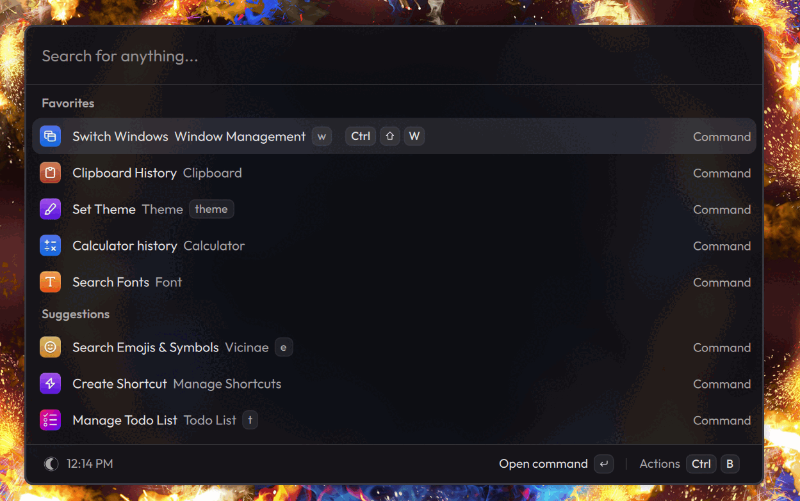

# better-nsticky

[](https://github.com/fram446742/better-nsticky/actions/workflows/check.yml)
[](https://codecov.io/gh/fram446742/better-nsticky)
[](https://github.com/fram446742/better-nsticky/blob/main/Cargo.toml)

A fork of [lonerOrz/nsticky](https://github.com/lonerOrz/nsticky) that stays a
drop-in replacement: same `nsticky` binary, same `~/.config/nsticky`, same
socket and same Home Manager option names. Only the repository is named
differently, so it can carry its own fixes and features (rule exclusions,
`[stage.*]` rules, a configurable stage workspace, persisted state, a private
socket, selector discovery, one IPC connection). See
[Differences from upstream](#differences-from-upstream).

`nsticky` is a window helper for [niri](https://github.com/YaLTeR/niri). It keeps
two kinds of windows out of your way: **sticky** windows, which follow you to
every workspace, and **staged** windows, which you park on their own workspace
and pull back when you need them. niri has neither, so `nsticky` moves the
windows itself.

## Differences from upstream

| Area | Upstream | Here |
| --- | --- | --- |
| Rules | `app-id`/`title` strings | string **or array**, `exclude-title`/`exclude-app-id` (aliases `not-*`) for negation |
| Auto-staging | — | `[stage.<name>]` rules park matching windows once |
| Stage workspace | hardcoded `stage` | `stage-workspace = "..."` |
| Scratchpad workspace | shared with the stage | `scratchpad-workspace = "..."` (kept separate) |
| Parking areas | wherever they end up | both kept at the end of the strip, scratchpad above stage |
| State | in memory only | persisted, reconciled with the compositor on start |
| Menu | `split_whitespace()` | shell-style quoting, array form, [Vicinae](https://www.vicinae.com/) discovery, never a shell |
| Monitors | sticky windows follow every activation | per-rule `output` pins, `sticky-follow = "own-output"`, activations that did not take focus are ignored |
| Scratchpads | — | `[scratchpad.<name>]` + one keybinding: hide/show/spawn a dropdown, floating and sized |
| Matching | app id + title | also `floating = true/false`, rule reload (`nsticky reload`, `SIGHUP`, niri's own reload) |
| CLI | — | `config check`, tables + `--json`, non-zero exits on failure |
| Daemon | — | operation lock, single instance, socket `0600`, bounded requests, one IPC connection |

## Installation

The binary is always `nsticky`, so any of these replace an existing install
without touching your configuration.

### From source

Needs Rust 1.88 or newer (on Arch, install `rustup` and `rustup default stable`:
the distro `rust` package *is* rustup, and nsticky uses let chains).

```bash
git clone https://github.com/fram446742/better-nsticky.git
cd better-nsticky
cargo build --release --locked
sudo install -Dm755 target/release/nsticky /usr/local/bin/nsticky   # or ~/.local/bin
```

Or let cargo build and install it in one go:

```bash
cargo install --path . --locked      # installs ~/.cargo/bin/nsticky
```

### Straight from the repository (RECOMMENDED)

No clone, no local checkout:

```bash
cargo install --git https://github.com/fram446742/better-nsticky --locked
```

`--locked` keeps the dependency versions from `Cargo.lock`, so you build what the
tests were run against.

### Arch / CachyOS

[`packaging/PKGBUILD`](packaging/PKGBUILD) builds a real package (and runs the
test suite as its `check()`):

```bash
packaging/make-pkg.sh          # build better-nsticky-<version>-<rel>-x86_64.pkg.tar.zst
packaging/make-pkg.sh -si      # build and install it (sudo)
```

The package is named `better-nsticky`, `provides`/`conflicts` with `nsticky`, and
installs `/usr/bin/nsticky`. It depends on `cargo` for building only. Once the
repository is pushed and tagged, the same PKGBUILD works for the AUR — swap the
`source` line for the tagged tarball as the comment in the file explains, then
run `updpkgsums`.

### Nix

```bash
nix profile install github:fram446742/better-nsticky
```

Or as a flake input / dev shell:

```bash
{
  inputs = {
    nixpkgs.url = "github:nixos/nixpkgs/nixos-unstable";
    flake-utils.url = "github:numtide/flake-utils";
    nsticky.url = "github:fram446742/better-nsticky";
  };

  outputs =
    inputs@{
      self,
      flake-utils,
      nixpkgs,
      ...
    }:
    flake-utils.lib.eachDefaultSystem (
      system:
      let
        pkgs = import nixpkgs {
          inherit system;
        };
      in
      {
        devShells.default = pkgs.mkShell {
          packages = [ inputs.nsticky.packages.${system}.nsticky ];
        };
      }
    );
}
```

For Home Manager there is `inputs.nsticky.homeModules.default`, see
[Configuration](#configuration).

### Upgrading from upstream `nsticky`

It is a drop-in replacement: the command, `~/.config/nsticky/config.toml`, the
Home Manager options (`programs.nsticky.*`) and the systemd unit keep their
names. Build the new binary, then restart the daemon so both sides agree:

```bash
systemctl --user restart nsticky     # or: nsticky --replace
```

Two things changed under the hood, both harmless if you upgrade this way:

- the CLI socket moved to `$XDG_RUNTIME_DIR/nsticky/cli.sock` (it used to be a
  fixed path in `/tmp`), so a new CLI cannot talk to an old daemon — restart it
  instead of running both;
- sticky/staged state is now persisted in `$XDG_STATE_HOME/nsticky/state.json`,
  and on startup the daemon adopts whatever is already on the stage workspace, so
  windows parked before the upgrade are picked up again.

Check the result with:

```bash
nsticky status                        # daemon, niri, paths and counts
nsticky config check                  # what nsticky understood from config.toml
```

### Quick start

1. Install [Vicinae](https://www.vicinae.com/) if you want `stage restore` to
   open the recommended selector (any dmenu-compatible program works).
2. Write `~/.config/nsticky/config.toml` — start from
   [the example](#configuration) (it can be empty: nsticky then does nothing).
3. Let niri start the daemon: `spawn-at-startup "nsticky"` in `~/.config/niri/config.kdl`
   (or `systemctl --user enable --now nsticky` with the Home Manager module).
4. Bind the shortcuts you want:

   ```kdl
   Mod+Ctrl+Space { spawn "nsticky" "sticky" "toggle-active"; }
   Mod+Shift+Space { spawn "nsticky" "stage" "toggle-active"; }
   Mod+Shift+R { spawn "nsticky" "stage" "restore"; }
   ```

5. Check it: `nsticky status`.

## Configuration

Create `~/.config/nsticky/config.toml` to auto-sticky windows matching rules:

```toml
menu = "vicinae dmenu --placeholder 'Restore Window:'"

[sticky.zen]
app-id = "zen"
title = ".*Picture-in-Picture.*"

[sticky.firefox_picture_in_picture]
app-id = "firefox"
title = ".*Picture-in-Picture.*"

[sticky.pavucontrol]
app-id = "pavucontrol"

[sticky.music_players]
app-id = [
    "Spotify",
    "Amberol"
]

[sticky.dropdown_term]
app-id = [
    "kitty",
    "foot",
    "alacritty"
]
title = ".*dropdown-terminal.*"

[sticky.discord]
app-id = [
    '^[Dd]iscord$',
    '^[Vv]encord$',
    '^[Vv]esktop$'
]

exclude-title = [
    '^\(\d+\) [Dd]iscord \|.*$',
    '^[Dd]iscord$|^[Vv]esktop$|^[Vv]encord$',
    '^[Cc]anal$|^[Cc]hannel$|^[Dd]irectos$|^[Ss]treams?$'
]

# Park games on the stage workspace as soon as they open.
[stage.games]
app-id = ["steam_app_.*", "^lutris$"]

# A dropdown terminal toggled by one key: it parks on its own workspace, so it
# never shows up in `stage restore`.
[scratchpad.term]
app-id = "foot"
title = "dropdown-terminal"
spawn = ["env", "DROPDOWN_TERM=1", "foot", "--app-id", "foot", "--title", "dropdown-terminal"]
```

```kdl
Mod+Shift+Return { spawn "nsticky" "scratchpad" "term"; }
```

### Matching rules

A window matches a rule when **all** positive fields match and **no** exclusion
matches:

```text
positive app-id matches
    AND positive title matches
    AND NOT exclude-app-id matches
    AND NOT exclude-title matches
```

| Field | Meaning |
| ----- | ------- |
| `app-id` | Positive app ID pattern(s) |
| `title` | Positive window title pattern(s) |
| `exclude-app-id` | App ID pattern(s) that reject the window |
| `exclude-title` | Title pattern(s) that reject the window |

- `app-id` and `title` are AND logic; each field's list is OR logic between its
  patterns.
- `exclude-*` lists are AND logic between their negations: a window is rejected
  as soon as **one** exclusion pattern matches.
- Every field accepts either a single string (`app-id = "firefox"`) or an array
  (`app-id = ["firefox", "zen"]`).
- If a positive field is omitted, it matches any value. If an attribute is
  absent from a window, its exclusions cannot match it.
- A rule needs at least one positive field (`app-id` or `title`); rules with
  only exclusions are ignored, as they would otherwise match every window.
- The underscore spellings (`app_id`, `exclude_title`, ...) still work; the
  hyphenated ones are the documented form. `not-title` / `not-app-id` are
  accepted as aliases of `exclude-title` / `exclude-app-id`. If several aliases
  of the same field are present, their patterns are combined.

Patterns are Rust [`regex`](https://docs.rs/regex) patterns, so `(?i)^discord$`
matches `Discord`, `DISCORD`, `discord` or `DiScOrD`. Lookaround (`(?!...)`,
`(?<=...)`) is not available: the `regex` crate does not backtrack, and no custom
dialect is implemented on top of it. Use `exclude-title` / `exclude-app-id` for
negation:

```toml
[sticky.discord]
app-id = '^[Dd]iscord$|^[Vv]encord$|^[Vv]esktop$'
exclude-title = '^[Cc]anal$|^[Cc]hannel$|^[Dd]irectos$|^[Ss]treams?$'
```

Invalid patterns fail with the rule, the field and the offending pattern:

```text
Invalid exclude-title regex in sticky.discord: "^(Discord$"
regex parse error: ...
```

### Stage rules

`[stage.<name>]` accepts exactly the same matching fields, but parks matching
windows on the stage workspace instead of making them sticky:

```toml
[stage.games]
app-id = ["steam_app_.*", "^lutris$"]
exclude-title = "^Launcher$"
```

- Sticky rules are declarative: a window matching one is re-added to the sticky
  list whenever it changes.
- Stage rules fire once per window and daemon run, so `stage restore` is not
  immediately undone by the next event the restored window emits. Restarting
  the daemon lets the rule see the window again.
- If a sticky and a stage rule both match a window, the sticky rule wins, so
  adding a stage rule never changes the behaviour of an existing config.

### Menu command

`menu` feeds the staged window list to an external selector (any dmenu-compatible
program). The value is split with shell-style quoting rules but never passed to a
shell: the program is executed directly with the parsed argv.

[**Vicinae**](https://www.vicinae.com/) is the recommended selector. It is a
launcher, so the same command that picks a staged window also gives you the rest
of its palette.

```toml
menu = "vicinae dmenu --placeholder 'Restore Window:'"
```

is parsed as program `vicinae` with arguments `dmenu`, `--placeholder`,
`Restore Window:` — the quoted argument stays a single argument.

With neither `NSTICKY_MENU` nor `menu` set, `stage restore` uses the built-in
terminal prompt when stdin is a terminal, and otherwise tries the selectors it
knows in this order: vicinae, `rofi`, `fuzzel`, `wofi`, `pantry`. Bound to a
shortcut there is no terminal and no prompt to show, so it exits with an error
listing the candidates it looked for.

An array form is also accepted and skips parsing entirely:

```toml
menu = ["vicinae", "dmenu", "--placeholder", "Restore Window:"]
```

If the selector cannot be launched, the error lists the original command, the
program, the arguments and the underlying reason. If it starts but exits with a
non-zero status, the exit status is reported and the windows are left staged.

### Scratchpads

`stage` parks any number of windows and `stage restore` brings them back through
the selector. A scratchpad is the other half: one window that goes away and comes
back with the same key, no selector involved.

```toml
[scratchpad.term]
app-id = "dropdown-terminal"     # matching fields, exactly like a rule
spawn = ["env", "DROPDOWN_TERM=1", "foot", "--app-id", "dropdown-terminal", "--title", "dropdown-terminal"]
float = true                     # default
```

```kdl
Mod+Shift+Return { spawn "nsticky" "scratchpad" "term"; }
```

One press does one of three things:

- a matching window is visible (or staged by hand): park it on its own workspace,
  remembering where it was and how big it was;
- the window it parked before is still parked: bring it back to the focused
  workspace, floating and focused, at that remembered size and position;
- nothing matches and `spawn` is set: start it.

Its own workspace is what keeps the two areas apart: `stage restore` never brings
back a scratchpad window, and the scratchpad workspace comes and goes with the
window it holds.

The remembered geometry is what makes it come back where it was. `width`/`height`
are only a fallback the first time, when there is nothing to remember; leave them
out and niri's own `window-rule` decides how the window opens. Sizes are pixels
(`"800"`) or a percentage (`"60%"` is 60%, not 0.6).

#### Toggling whatever is focused

Without matching fields, or without a name at all, the scratchpad works on the
focused window instead of a configured one. No configuration is needed:

```bash
nsticky scratchpad            # take the focused window away, press again to get it back
```

A named section with no matching fields still carries the options (`float`,
size):

```toml
[scratchpad.focus]
float = true
```

```kdl
Mod+Alt+S { spawn "nsticky" "scratchpad" "focus"; }
```

The key never names a window: the scratchpad keeps the window it parked in its
state, so the second press brings that same window back even if focus moved on.
Restoring the window another way (a `stage restore`, or closing it) clears the
slot. The slot is persisted, so it survives a daemon or session restart.

#### Opening floating and positioned

For a window that has never been shown, the initial float, size and position are
better left to niri:

```kdl
window-rule {
    match app-id=r#"^dropdown-terminal$"#
    open-floating true
    default-floating-position x=0 y=60 relative-to="top"
    default-window-height { fixed 480; }
    default-column-width { fixed 1100; }
}
```

`nsticky config check` lists the configured scratchpads with their size, floating
state and command.

### Sticky windows on several monitors

By default a sticky window follows the workspace that becomes focused, wherever
it is. With more than one monitor that is rarely what you want, so a rule can
pin a window to a monitor:

```toml
[sticky.discord]
app-id = "discord"
output = "DP-2"                 # or a preference list: ["DP-2", "DP-1"]
```

A pinned window stays on its monitor: activations on other outputs leave it
alone, and it is moved back to that monitor's active workspace if it lands
elsewhere. Several outputs are a preference order: the first connected one wins,
and if none is connected the window follows the focused workspace rather than
becoming unreachable.

For windows no rule pins, `sticky-follow` decides globally:

```toml
sticky-follow = "own-output"    # "focused" (default) or "own-output"
```

- `focused`: follow the focused workspace, everywhere (upstream behaviour).
- `own-output`: stay on the monitor the window was on when it became sticky.

A window lives on exactly one workspace, so a single window cannot appear on two
monitors at once. `own-output` is for keeping several windows of the same
application on different monitors: pin one rule per window with distinct `title`
patterns, or let each window stay on the monitor it was opened on:

```toml
sticky-follow = "own-output"

[sticky.terminals]
app-id = ["kitty", "foot"]
```

Each terminal then stays on the monitor it was on, and only follows that
monitor's workspace changes.

### Stage workspace

Staged windows are parked on a workspace named by `stage-workspace` (default
`stage`), and nsticky creates that workspace when it is first needed:

- staging the first window names the empty workspace at the bottom of that
  window's monitor and moves the window there, without focusing it, so your view
  does not move;
- when the last parked window leaves, nsticky gives the name back and niri
  reclaims the workspace: nothing is left behind and your dynamic workspace
  numbering stays as it was.

You therefore do not need `workspace "stage" { … }` in niri's configuration.
Declaring it is what makes the stage permanent: niri never removes a named
workspace, so it stays in your strip forever, and if it is the only workspace you
declare it also becomes the one niri opens by default and shifts every dynamic
workspace index.

If you do want a fixed parking space that also has a name you can bind keys to,
say so:

```toml
stage-workspace = "parking"        # name used while windows are parked
stage-keep-workspace = true        # keep the workspace while nothing is parked
```

An empty name, or two conflicting spellings of a key (`stage-workspace` and
`stage_workspace`), is a configuration error.

#### Two parking areas, kept apart

A scratchpad does not use the stage: it parks its window on its own workspace,
named by `scratchpad-workspace` (default `scratchpad`), so a dropdown terminal
never turns up in `stage restore`. A window belongs to one area at a time:
hiding a scratchpad takes it out of the stage, and staging it afterwards takes it
out of the scratchpad.

Both areas sit at the bottom of their monitor, below every workspace you work on,
in a fixed order:

```text
  one, two, dev, …    ← the workspaces you work on
  scratchpad          ← parked scratchpad windows (only while one is parked)
  stage               ← parked staged windows     (only while one is parked)
  (empty tail)        ← the empty workspace niri always keeps at the bottom of an output
```

- whenever a workspace appears below them they follow it down, so a parking area
  never ends up in the middle of the strip;
- the scratchpad is always above the stage, whatever order windows were parked in;
- only the empty workspace niri keeps at the bottom of a monitor is ever renamed,
  and never one area into the other, so a workspace you named is left alone.

```toml
scratchpad-workspace = "drop"      # name used while a scratchpad window is parked
```

#### About "hidden" workspaces

niri has no Hyprland-style special workspace that can be hidden away; its
maintainer has said a scratchpad would have to be built on the floating layer.
Other tools that implement scratchpads for niri hit the same wall and say so: the
scratch workspace stays reachable with `focus-workspace-down` and visible in the
overview, and declaring it perturbs dynamic workspaces (`niri-scratchpad`
recommends declaring every workspace explicitly; `nirius` uses the bottom-most
workspace and moves windows out of it when you navigate there).

nsticky takes the achievable part: the stage exists only while something is
parked on it, it sits at the bottom of the strip, and it leaves no trace when
empty. Parking never steals focus, and `stage restore` brings windows back
through a selector instead of making you navigate to the workspace.

### Reloading the configuration

The daemon reads `config.toml` at startup. Apply edits without restarting it:

```bash
nsticky reload                          # or: systemctl --user kill -s HUP nsticky
```

Rules take effect for windows that open or change afterwards. A file that cannot
be read or parsed is refused and the running configuration is kept, so a typo
never leaves the daemon without rules. niri reloads its own configuration on
demand, so `nsticky` does the same at the same moment.

### State and restarts

nsticky remembers which windows are sticky and which are staged in
`$XDG_STATE_HOME/nsticky/state.json` (falling back to
`~/.local/state/nsticky/state.json`), so restarting the daemon or the session
does not lose track of them. On startup the stored state is reconciled against
the compositor:

- windows that no longer exist are dropped, scratchpad slots included: a slot
  remembers the window it parked and its size and position;
- whatever sits on the stage workspace is adopted as staged, even when the state
  file is missing or stale, because the compositor decides what is parked;
- the "was sticky before being staged" flag comes from the state file, since the
  compositor cannot know it;
- if niri is unreachable the stored state is left untouched instead of wiped.

### Configuration reference

| Key | Default | Meaning |
| --- | --- | --- |
| `menu` | none | Selector for `stage restore` (string or array); discovered from `PATH` when unset and there is no terminal |
| `stage-workspace` | `stage` | Name used for the workspace staged windows are parked on |
| `stage-keep-workspace` | `false` | Keep that workspace (and its name) while nothing is parked |
| `scratchpad-workspace` | `scratchpad` | Name used for the workspace scratchpad windows are parked on (aliases: `scratchpad_workspace`) |
| `sticky-follow` | `focused` | How sticky windows without an `output` pin follow workspaces (`focused` or `own-output`) |
| `[sticky.<name>]` | — | Rule that pins matching windows to every workspace |
| `[stage.<name>]` | — | Rule that parks matching windows on the stage workspace once |
| `[scratchpad.<name>]` | — | One window toggled by `nsticky scratchpad <name>`: parked ⇄ shown, started if missing. No matching fields means "the focused window" |

The two workspace names must be different, non-empty and are a configuration
error otherwise. Normally you declare neither: nsticky parks on the unnamed empty
workspace at the bottom of a monitor and gives the name back when the last window
leaves (`stage-keep-workspace` keeps the stage one). If you *do* declare a
workspace with one of those names in niri, nsticky finds it and uses it instead of
creating one.

Rule fields: `app-id`, `title`, `exclude-app-id`, `exclude-title` (aliases:
`app_id`, `exclude_title`, `not-title`, …). Each accepts a string or an array of
`regex` patterns; negation is expressed with the `exclude-*` fields, since the
`regex` crate has no lookaround. Rules can also constrain `floating` (`true`/
`false`) and pin the window to one or more `output` monitors in preference order.

You can also configure nsticky from the home-manager module:

```nix
{ inputs, ... }:

{
  imports = [
    inputs.nsticky.homeModules.default
  ];

  programs.nsticky = {
    enable = true;
    menu = "vicinae dmenu --placeholder 'Restore Window:'";   # optional: selector for `stage restore`
    settings = {
      sticky = {
        firefox.app-id = "firefox";

        kitty = {
          app-id = "kitty";
          title = ".*server.*";
        };

        gmail.title = ".*Gmail.*";

        discord = {
          app-id = [ "^[Dd]iscord$" "^[Vv]encord$" "^[Vv]esktop$" ];
          exclude-title = [ "^[Cc]anal$" "^[Cc]hannel$" ];
        };
      };
    };
  };
}
```

---

## How sticky windows work

niri has no native sticky windows. `nsticky` tracks the windows you pin and moves
them to the workspace that becomes active, so they follow you, including across
outputs. Staged windows stay parked until you restore them: a window is never
sticky and staged at the same time.

---

## Usage

### Daemon mode

Configure `niri` to auto-start the `nsticky` daemon:

```bash
spawn-at-startup "nsticky"
```

The daemon needs `NIRI_SOCKET` (checked at startup) and keeps a single connection
to niri for all its requests. It is single-instance: a second one fails with a
clear message instead of taking the socket away from the running daemon, unless
you ask for it with `nsticky --replace`. The CLI socket is created with mode
`0600`, so only its owner can talk to it, and requests larger than 64 KiB are
rejected instead of being buffered.

The CLI reaches the daemon over `$XDG_RUNTIME_DIR/nsticky/cli.sock`, falling back
to `/tmp/niri_sticky_cli.sock` when that variable is unset. Both sides must agree
on the path: after upgrading from a version that used the fixed `/tmp` socket,
restart the daemon.

### Command line

Control `nsticky` from the terminal.

#### Sticky windows

```bash
nsticky sticky add <window_id>
nsticky sticky remove <window_id>
nsticky sticky list
nsticky sticky toggle-active
nsticky sticky toggle-appid <appid>
nsticky sticky toggle-title <title>
```

`add` and `remove` take a window id (`niri msg --json windows` gives you the
ids). The `toggle-*` variants work on the focused window, on a window with a
given app id, or on one whose title matches a pattern.

#### Staging

```bash
nsticky stage list
nsticky stage add <window_id>
nsticky stage remove <window_id>
nsticky stage toggle-active
nsticky stage toggle-appid <appid>
nsticky stage toggle-title <title>
nsticky stage add-all
nsticky stage remove-all
nsticky stage restore
```

`add-all` and `remove-all` move every sticky window to the stage and every
staged window back. `restore` pipes the staged windows to the configured
selector and brings back the ones you pick, more than one if you want.

#### Everything else

```bash
nsticky status                          # daemon, niri, paths and window counts (non-zero exit when the daemon is down)
nsticky reload                          # re-read config.toml without restarting the daemon
nsticky scratchpad [name]               # toggle a scratchpad: hide, show, or start it (no name: the focused window)
```

#### Machine-readable output

```bash
nsticky windows --json                  # JSON window list
nsticky sticky list --json              # JSON array of sticky window ids
nsticky config check --json             # resolved paths, stage workspace, follow mode and every compiled rule
```

`--json` is a global flag. Anything that fails (no daemon, unknown window, broken
config) exits non-zero and prints the reason on stderr.

#### Configuration check

`nsticky config check` prints the config path, the stage workspace, the selector
command and one line per rule with the number of patterns each field compiled to.
It exits non-zero if the file cannot be read or parsed:

```text
config:          /home/you/.config/nsticky/config.toml
state:           /home/you/.local/state/nsticky/state.json
stage workspace: parking (kept while empty: false)
scratchpad:      scratchpad (windows parked there)
sticky follow:   focused
menu:            vicinae dmenu --placeholder 'Restore Window:'
scratchpads:
  term            1100x480, floating, spawn: foot --app-id foot --title dropdown-terminal
rules:
  sticky discord  app-id: 2, exclude-title: 1
  stage  games    app-id: 2, exclude-title: 1
```

`--json` prints the same as an object; scripts and editor integrations should
read that one.

<p align="center">
  <a href="https://www.vicinae.com/">
    
  </a>
  <br>
  <em>Vicinae, the recommended selector (<a href="https://www.vicinae.com/">vicinae.com</a>)</em>
</p>

`stage restore` does not care which selector you use, and the window list it
feeds it is one `id<TAB>app_id<space>title` line per staged window.
`NSTICKY_MENU` overrides the configured `menu` and is parsed the same way. If
none of that is set it falls back to the discovery described in
[Menu command](#menu-command).

You can set up shortcuts in `niri`:

```bash
Mod+Ctrl+Space { spawn "nsticky" "sticky" "toggle-active"; }
Mod+Shift+Space { spawn "nsticky" "stage" "toggle-active"; }
Mod+Shift+R { spawn "nsticky" "stage" "restore"; }   # pick staged window(s) to restore
```

---

## Troubleshooting

**`stage restore` does nothing when bound to a shortcut.**
There is no terminal to prompt on. Set `menu = "..."`, or put one of vicinae
(recommended), `rofi`, `fuzzel`, `wofi`, `pantry` on `PATH`. With none of them
installed the command lists what it looked for and exits non-zero.

**Sticky or staged windows were forgotten.**
`nsticky config check` prints the state file path; the daemon logs the
reconciliation result at startup (`RUST_LOG=info nsticky`, or
`journalctl --user -u nsticky -f` under systemd). A daemon started with a
different `XDG_STATE_HOME` sees an empty state.

**My stage workspace shows up as the default workspace, or shifted my workspace
numbers.** It was declared in niri's configuration (usually
`workspace "stage" { … }` or an `open-on-output`): niri never deletes a named
workspace, so it stays for good. Remove that declaration (nsticky creates the
workspace while something is parked and releases it afterwards), or keep it on
purpose with `stage-keep-workspace = true`.

**A rule never matches.**
`nsticky config check` lists the compiled rules with their pattern counts. A rule
missing from that list had no positive field (`app-id` or `title`), or its
section is misspelled. Lookaround (`(?!…)`) is not supported: use `exclude-*`.

**My dropdown terminal is not in `stage restore` (or `stage list`).**
That is on purpose: a scratchpad parks its window on its own workspace, not on
the stage, so the two areas never mix. `nsticky scratchpad <name>`, or the key
you bound, brings it back; the same command parks it again.

**A parking area sits in the middle of my strip, or above another workspace.**
nsticky moves both areas back to the end of their monitor whenever the workspace
list changes, and it only ever parks on the empty, unnamed workspace niri keeps
at the bottom. A workspace you named yourself is never taken over, so if your
strip has no unnamed empty workspace at the end, for instance because every
workspace is declared in niri's configuration, parking has nowhere to go: drop
those declarations and let niri manage the tail. `RUST_LOG=debug nsticky` logs
which workspace it names and releases.

**The parking areas show up in the overview / on `focus-workspace-down`.**
niri has no hidden workspaces, which is a compositor limitation rather than a bug
(see [About "hidden" workspaces](#about-hidden-workspaces)). nsticky parks them
at the bottom, keeps them out of your way and gives their names back as soon as
nothing is parked on them.

**"Another nsticky daemon is already running".**
Something still listens on the socket: `systemctl --user restart nsticky`, or
`nsticky --replace` to take it over deliberately.

**The CLI cannot reach the daemon.**
Restart it: the old process may still be listening on the previous socket path.

---

## Development

```bash
cargo test --all-features                                   # unit tests
cargo clippy --all-targets --all-features -- -D warnings
cargo fmt --check
cargo build && scripts/e2e-smoke.sh                         # end-to-end
```

### End-to-end smoke test

`scripts/e2e-smoke.sh` runs the real binary against a fake niri IPC server in an
isolated `XDG_*` environment: no session needed, nothing on your desktop is
touched. The fake speaks niri's JSON protocol, sends the initial state on the
event stream and publishes `WorkspaceActivated` events when asked to focus a
workspace.

- `config check` (valid and broken), socket permissions, `--json` output, exit
  codes;
- state persisted across a daemon restart, windows on the stage workspace being
  adopted;
- scratchpads: their own workspace (separate from the stage), the geometry they
  remember, and the empty area being released when the window comes back;
- the parking areas ending up at the end of the strip, in order, and following it
  down again when a workspace appears below them;
- monitor pinning: a window on the wrong monitor is put back, a pinned window
  ignores other monitors' activations and follows its own, `sticky-follow =
  "own-output"` holds, and reloading a configuration re-pins tracked windows;
- selector discovery and the actionable failure when nothing is installed;
- a second daemon refusing to hijack the socket.

Needs `python3` for the fake compositor.

### Coverage

`scripts/coverage.sh` runs the unit tests and then the smoke test against the
instrumented binary, so `main.rs` and the daemon's real socket are counted too:

```bash
scripts/coverage.sh                                    # summary
LCOV_PATH=lcov.info HTML_DIR=target/cov-html scripts/coverage.sh
MIN_LINES=90 scripts/coverage.sh                       # fail on a regression
```

The `coverage` workflow runs the same script on every push and pull request,
uploads `lcov.info` to Codecov (that is the second badge above) and keeps the
HTML report as a workflow artifact.

---

## License

This project is licensed under the BSD 3-Clause License.

---

## AI disclosure

A good part of this fork is vibecoded: it was written with AI coding assistants,
and pretending otherwise would be dishonest. The verification is not. Every
change is built, linted and exercised before it lands (`cargo test`,
`cargo clippy --all-targets --all-features -- -D warnings`, `cargo fmt --check`,
`scripts/e2e-smoke.sh`), and it is also run on a real Wayland session, not only
in CI:

| Component | Version |
| --- | --- |
| niri | 26.04 |
| Distribution | CachyOS (Arch-based) |
| Kernel | 7.2.5 |
| Rust | 1.88 or newer (local toolchain: 1.100.0-nightly) |
| GPU driver | AMD Radeon RX 9070 (Mesa/amdgpu) |

That covers the paths listed in [Development](#development) and the niri IPC
semantics the code relies on, but it is one machine and one compositor version,
so behaviour elsewhere may differ. Bug reports are welcome.

---

> If you find `nsticky` useful, please give it a ⭐ and share! 🎉
